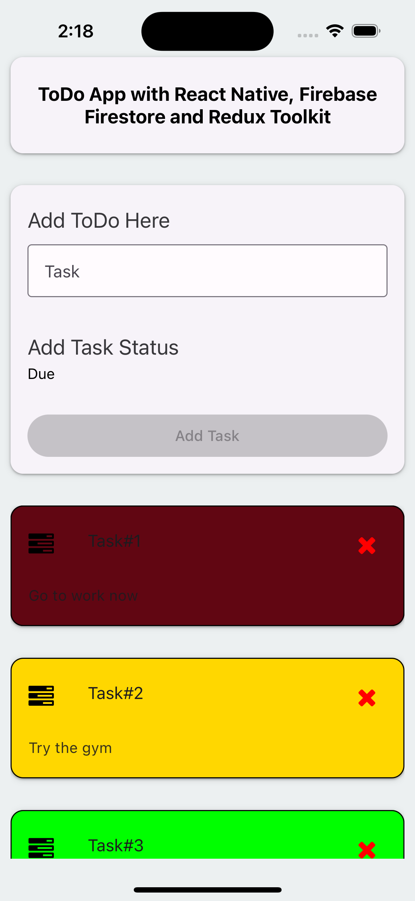

# ToDO APP With React Native & Redux Toolkit

## Using useState, this app allows modification of added tasks to change header and status

## Screenshots

### Adding tasks

### Modifying Added tasks

